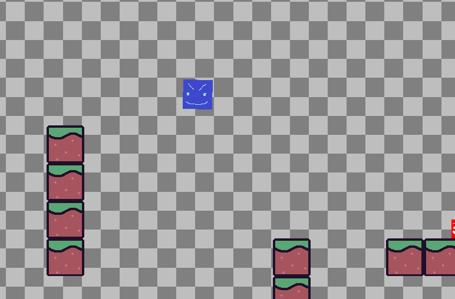

# 2.3 Stage setup

## Design

### Objectives

Set up environment for the Player

* [x] Do a thing
* [x] Do another thing

### Usability Features

### Key Variables

| Variable Name       | Use                                                    |
| ------------------- | ------------------------------------------------------ |
| Set Gravity         | Sets the constant downward acceleration                |
| Set Speed           | Sets  Movement speed                                   |
| constant add player | Add player into the environment                        |
| Anchor              | Show the anchor point of the Sprite                    |
| Load Sprite         | Used to input what each symbol represents in the level |
| Area                | Collision detection (T/F)                              |
| Body                | Static properties (T/F)                                |

### Pseudocode

```
Import Kaboom

Set Gravity:
Set Speed:

Load Sprite(Player)

constant add player
sprite(player)
area
body
anchor


  
  
```

## Development&#x20;

### Outcome

```
loadSprite("Floor", "sprites/Floor.png");

const LEVELS = addLevel([
  ["    ==        ",
   "===    ==     ",
   "           == ",
  ],
  
  tileWidth: 50,
  tileHeight: 50,
  
  pos: vec2(100, 200),
  
  tiles: {
      "=": () => [
        sprite("player"),
        area(),
        body({ isStatic: true }),
       }

```

### Challenges

Description of challenges

## Testing


Evidence for testing

### Tests

| Test | Instructions  | What I expect     | What actually happens | Pass/Fail |
| ---- | ------------- | ----------------- | --------------------- | --------- |
| 1    | Run code      | Thing happens     | As expected           | Pass      |
| 2    | Press buttons | Something happens | As expected           | Pass      |

### Evidence


